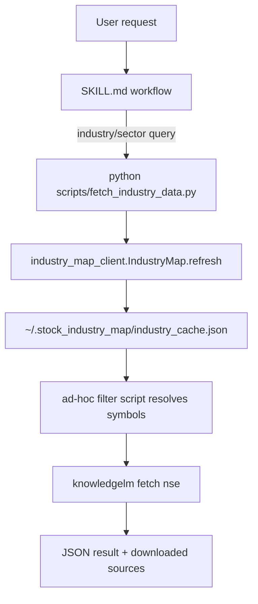

# MAP

## Purpose

`knowledgelm-nse` is an agent skill wrapper around external CLIs (`knowledgelm`,
optionally `notebooklm`) plus a local helper script that refreshes industry
mapping cache via the shared `industry_map_client`.

## Repository layout

- `SKILL.md`: core runtime instructions used by the agent.
- `scripts/fetch_industry_data.py`: helper script invoked by skill flow to
  refresh/get local industry cache path.
- `references/notebooklm_audio_prompt.md`: optional prompt artifact referenced
  by `SKILL.md`.
- `context/`: agent-maintained durable docs.

## Data flow

## Runtime boundaries

- This repo does not ship the L3 industry fetch implementation.
- `scripts/fetch_industry_data.py` delegates to shared
  `industry_map_client` and only returns a stable JSON contract:
  `{"success": true, "cache_path": "..."}`.
- Missing client dependency is handled by returning structured JSON error with
  install hint.
